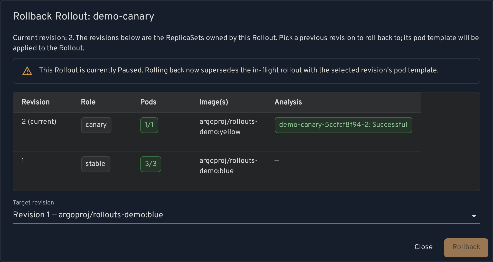
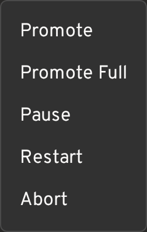

# headlamp-argo-rollouts

A [Headlamp](https://headlamp.dev) plugin that adds [Argo Rollouts](https://argoproj.github.io/rollouts/)
(`rollouts.argoproj.io`) support. Argo Rollouts are custom resources, so Headlamp's generic CR handling
knows neither how to roll them back nor how they own their ReplicaSets; this plugin fills both gaps.

## Features

### Revision history + rollback (detail page)

Adds a revision history section and a rollback button to the Argo Rollout detail page. The algorithm ports
Headlamp core's Deployment rollback (equivalent to `kubectl rollout undo`) to Rollout: it lists the
ReplicaSets owned by the Rollout, reads the revision from the `rollout.argoproj.io/revision` annotation,
copies the target revision's `spec.template`, drops the `rollouts-pod-template-hash` label, and applies a
`{op: replace, path: /spec/template}` JSON Patch to the Rollout. (Requires `patch` RBAC on
`rollouts.argoproj.io` for the cluster user.)

The revision history is enriched toward the dashboard's revisions panel: each revision shows its ReplicaSet
**role** (stable / canary / active / preview), **pod** counts (available/total, health-colored), and any
attached **AnalysisRuns** with their phase (matched to the revision by `rollouts-pod-template-hash`). Roles and
pod counts come from the client-side `RolloutInfo` derivation (no extra fetch); AnalysisRuns are read
best-effort (absent CRD or no access simply shows none). Full AnalysisRun metric charts remain out of scope —
run the official dashboard for those.

Argo Rollouts are custom resources, and Headlamp's generic custom-resource detail view renders only header
actions (not registered detail-view sections), so the entry point is a `registerDetailsViewHeaderAction`; the
component renders nothing for non-Rollout resources.



### Progressive-delivery actions (detail page)

A **Rollout actions** menu in the detail header, offering (only when applicable to the current state) the same
controls as `kubectl argo rollouts`: **Promote**, **Promote Full**, **Pause**, **Resume**, **Restart**,
**Abort**, **Retry**. Each is a plain Kubernetes patch on the Rollout (the same mechanism as the rollback),
confirmed via a dialog before it runs.

- **Promote** advances to the next step by clearing the pause condition (`status.pauseConditions: null`) and
  bumping `status.currentStepIndex`; **Promote Full** (`status.promoteFull`) finishes the whole rollout.
- **Set Image** — a separate header action that changes a container's image (a targeted JSON Patch), starting a
  new revision. Rollouts driven by a `workloadRef` point you at the referenced workload instead.
- **RBAC-gated:** the rollback, actions menu, and Set Image button all **hide themselves** when the user cannot
  `patch` the Rollout (checked via a `SelfSubjectAccessReview`), so a read-only user isn't shown controls that
  would 403. Promote / Promote-Full / Abort / Retry additionally patch the `status` subresource (with a fallback
  to the main resource on older CRDs), so an operator needs `patch` on **`rollouts/status`** as well as
  `rollouts`.



> The screenshots above are regenerated automatically: the [`Screenshots`
> workflow](.github/workflows/screenshots.yaml) renders the plugin in a real Headlamp against a kind cluster
> and opens a PR when they change (see [`e2e/`](./e2e)). So they double as a runtime smoke test.

### Rollouts list columns

On the Rollouts list page, adds **Strategy**, **Rollout status** (a colored health chip), **Step** (`N/M`), and
**Weight** columns via `registerResourceTableColumnsProcessor` — an at-a-glance view of every Rollout's
progress, like the official dashboard's list. Values come from a client-side port of Argo's `RolloutInfo`
derivation (`src/rolloutInfo.ts`); these columns need only the Rollout object, so no extra per-row fetches.

### Map view hierarchy

Adds a Rollout node and a Rollout→ReplicaSet ownership edge via `registerMapSource` so that, in the Map (graph)
view, the Rollout appears as the parent of the ReplicaSets it owns, drawing the same
Rollout→ReplicaSet→Pod hierarchy as the built-in Deployment→ReplicaSet→Pod. Enabled by default. Without it, a
Rollout's ReplicaSets render as top-level nodes because the built-in Map does not know the custom resource owns
them.

## Relation to the official Argo Rollouts Dashboard

This plugin is **frontend-only by design** — it uses no extra backend and talks only to the Kubernetes API
(the same way the rest of Headlamp does). The official
[Argo Rollouts Dashboard](https://argo-rollouts.readthedocs.io/en/stable/dashboard/)
(`kubectl argo rollouts dashboard`) instead runs an Argo API server that computes a rich, aggregated view and
streams it to its UI.

Because we don't run that server, this plugin **re-implements a subset** of the dashboard's views client-side
and cannot reach full parity. Notably out of scope / reduced fidelity:

- Server-streamed live updates (Headlamp's own polling/watch is used instead).
- Full AnalysisRun metric charts and the Experiments/AnalysisTemplate browsers.
- Anything else that depends on the Argo dashboard API server's aggregation.

For the complete progressive-delivery experience, **run the official
[`kubectl argo rollouts dashboard`](https://argo-rollouts.readthedocs.io/en/stable/dashboard/)** alongside
Headlamp. What this plugin does aim to bring in is tracked under the `mvp` / `v1`
[milestones](https://github.com/portone-io/headlamp-argo-rollouts/milestones).

## Status & support

> **Heads-up:** this plugin was built for a proof-of-concept at [PortOne](https://portone.io) and is shared
> as-is. It is **not published to [Artifact Hub](https://artifacthub.io)** and is not maintained as a general
> community project, so it will not appear in Headlamp's Plugin Catalog. If it is useful to you, please **fork
> it** and adapt/maintain it for your own needs. No support or compatibility guarantees are provided.

## Compatibility

Verified against **Headlamp v0.45.0** and built with `@kinvolk/headlamp-plugin`
`^0.14.0`. The newest Headlamp APIs this plugin relies on are the Map source API
(`registerMapSource`) and the plugin i18n runtime, so the supported range is
declared conservatively as **`>=0.43`** in
[`artifacthub-pkg.yml`](./artifacthub-pkg.yml)
(`headlamp/plugin/version-compat`); `distro-compat` covers in-cluster, web,
docker-desktop, and desktop. CI type-checks and builds against both the pinned
and the latest SDK to catch API drift.

## Install

Download the tarball from a [GitHub Release](https://github.com/portone-io/headlamp-argo-rollouts/releases)
and extract it into your Headlamp plugins directory so the layout is
`<plugins-dir>/headlamp-argo-rollouts/main.js`:

```bash
curl -sSL https://github.com/portone-io/headlamp-argo-rollouts/releases/download/v0.1.0/headlamp-argo-rollouts-0.1.0.tar.gz \
  | tar -xz -C <plugins-dir>
```

For the desktop app `<plugins-dir>` is Headlamp's plugins folder; for in-cluster deployments bake it into the
image under `/headlamp/plugins/`.

## Develop

```bash
npm install
npm run start   # run against a local Headlamp
npm run tsc     # type check
npm run lint
npm run build   # produce dist/main.js
npm run package # produce the distributable <name>-<version>.tar.gz (+ sha256)
```

Built on [`@kinvolk/headlamp-plugin`](https://github.com/headlamp-k8s/headlamp/tree/main/plugins/headlamp-plugin).

## Contributing

See [CONTRIBUTING.md](./CONTRIBUTING.md) for the dev loop, testing/commit
conventions, and how releases are cut. Security reports go through
[private vulnerability reporting](./SECURITY.md).

## License

[MIT](./LICENSE)
